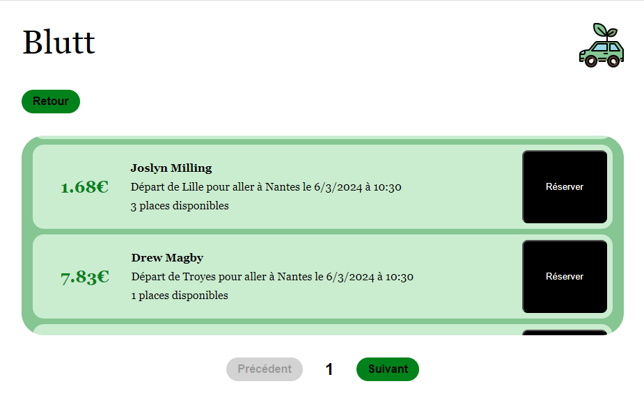

# Réduction de l'impact numérique d'un service numérique de covoiturage quotidien.

## Choix du sujet

Une portion non négligeable d'étudiants ont une voiture, et l'utilisent pour aller en cours. Les applications de covoiturage journaliers gagnent en popularité avec par exemple BlaBlaCar daily ou bien Karos (surtout dans le cadre de l'UTT où les trajets Karos sont remboursés par le département de l'Aube). Il nous semble utile de contribuer à cet essor des applications de covoiturage en proposant une application qui non seulement permet à ses utilisateurs de partager leurs trajets, mais est aussi soucieuse de l'impact environnemental de ses services numériques.

## Utilité sociale

En 2017, 74% des actifs en emploi qui déclarent se déplacer pour rejoindre leur lieu de travail utilisent leur voiture ([source : Insee](<https://www.insee.fr/fr/statistiques/5013868#:~:text=La%20voiture%20est%20le%20mode%20de%20transport%20privil%C3%A9gi%C3%A9%20pour%20aller,de%20personnes%20(figure%201).>)). De plus, sur plus d’un million de véhicules passés au crible de mai à juin 2022 sur 13 axes autoroutiers, **14,8 % seulement contenaient plus d’une personne, contre 17,4 % en 2021** ([source: roole.fr](https://media.roole.fr/transition/nouveaux-usages/autosolisme-85-des-francais-se-deplacent-seuls-en-voiture)) L'objectif est donc d'essayer de maximiser les trajets en voiture avec des passagers, en proposant aux conducteurs de prendre des passagers sur leur chemin en échange de rémunération. Augmenter le nombre de passagers moyens par voiture présente de multiples avantages sociaux et environnementaux, notamment :

- les coûts d'opération de la voiture (essence, maintenance, assurance) sont réduits pour le conducteur,
- les personnes sans voiture peuvent profiter de déplacements en voiture, qui peuvent être plus pratiques que les transports en communs ou les mobilités douces comme le vélo,
- le nombre total de voitures est réduit (deux personnes avec voiture peuvent choisir de covoiturer).

## Effets de la numérisation

De nos jours, la compétition dans le secteur des applications mobiles est rude et les fournisseurs d'application rivalisent de nouvelles fonctionnalités afin de gagner une place dans le téléphone des utilisateurs. Cette course aux fonctionnalités mène bien souvent à une grande augmentation des impacts environnementaux de l'activité de ces applications, on le voit par exemple avec la multiplication des fonctionnalités d'intelligence artificielle dans toutes les applications. D'après les chercheurs d'Open IA, la puissance de calcul requise pour l'entraînement des nouveaux modèles d'IA a doublé tout les 3.4 mois depuis 2012 ([source: earth.org](https://earth.org/the-green-dilemma-can-ai-fulfil-its-potential-without-harming-the-environment/)). Dans notre cas, nous cherchons donc à développer le minimum de fonctionnalités requises pour permettre au utilisateurs de Blutt de covoiturer correctement, tout en proposant une expérience utilisateur intuitive et agréable.

Les critères pour le développement sont les suivants :

- l'application ne doit pas chercher à remplacer des fonctionnalités déjà fournies par d'autre applications plus établies (exemple : pas de carte interactive, pas de fonctionnalité de messages intégrée...),
- l'application ne doit pas mener à une augmentation de l'usage de la voiture. Les trajets sur une distance aisément parcourue à pied doivent être découragés,
- l'impact général des systèmes numériques de l'application doit être le plus faible possible : pas d'intelligence artificielle pour faciliter les interactions ou d'algorithmes coûteux pour calculer les routes optimales. (On aurait par exemple pu en utiliser pour autoriser des requêtes de trajet en language naturel).

## Scénarios d'usage et impacts

Nous faisons l'hypothèse que les utilisateurs cherchant un trajet sur Blutt recherchent des trajets à effectuer régulièrement. Ils n'iront pas sur l'application tous les jours afin de créer un nouveau trajet. Une fois que le contact a été établi avec leur covoitureur, il feront les démarches en interne, sans passer par l'application. On établit deux scénarios possibles d'utilisation de l'application :

- je suis un conducteur et recherche des passagers, je publie mon trajet régulier sur Blutt,
- je suis passager et recherche un conducteur pour un trajet régulier, je recherche des trajets potentiels en spécifiant les horaires qui m'intéressent, ainsi que mes destinations de départ et d'arrivée.

### Scénario : trouver un covoiturage pour des trajet régulier

1. L'utilisateur entre sa destination de départ.
2. L'utilisateur entre sa destination d'arrivée.
3. L'utilisateur entre son horaire de départ souhaitée.
4. L'utilisateur lance la recherche de covoiturage en cliquant sur le bouton 'rechercher'.
5. L'utilisateur consulte la liste des covoiturages qui ont été trouvés, et en sélectionne un dans la liste.
6. L'utilisateur a accès à l'addresse mail du conducteur, et peut initier une démarche pour le contacter.

### Scénario : publier une offre de covoiturage pour des trajets réguliers

1. L'utilisateur clique sur le bouton 'Passer en mode conducteur'.
2. L'utilisateur entre sa destination de départ.
3. L'utilisateur entre sa destination d'arrivée.
4. L'utilisateur entre son horaire de départ souhaitée.
5. L'utilisateur sélectionne le nombre de places disponibles pour des passagers dans sa voiture.
6. L'utilisateur publie son trajet en cliquant sur le bouton 'publier mon trajet'.

## Impact de l'exécution des scénarios auprès de différents services concurrents

L'EcoIndex d'une page (de A à G) est calculé (sources : [EcoIndex](https://www.ecoindex.fr/comment-ca-marche/), [Octo](https://blog.octo.com/sous-le-capot-de-la-mesure-ecoindex), [GreenIT](https://github.com/cnumr/GreenIT-Analysis/blob/acc0334c712ba68939466c42af1514b5f448e19f/script/ecoIndex.js#L19-L44)) en fonction du positionnement de cette page parmi les pages mondiales concernant :

- le nombre de requêtes lancées,
- le poids des téléchargements,
- le nombre d'éléments du document.

Nous avons choisi de comparer l'impact des scénarios sur les services de deux solutions de covoiturage en ligne :

- [La roue verte](https://www.laroueverte.com)
- [Mobicoop](https://www.mobicoop.fr)

Ce sont deux solutions offrant des fonctionnalités similaires et qui ont la particularité de se vouloir des solutions simples et limitées en fonctionnalités contrairement à d'autres solutions plus populaires commme [BlaBlaCar](https://www.blablacar.fr) ou [Karos](https://www.karos.fr).

Ainsi, voici les résultats obtenus:

- [Résultats pour les deux scénarios](https://htmlpreview.github.io/?https://raw.githubusercontent.com/UTT-GL03/Blutt/refs/heads/main/benchmark/result.html)

## Maquette de l'interface et échantillon de données

Ainsi, en considérant les scénarios pris en compte dans l'étape précédante, nous avons décidé de créer des maquettes pour modéliser les pages de notre site et nous avons génerer un échantillon de données .
Concernant les maquettes, nous avons modélisé 4 pages:

1. La page d'accueil vue par un client
   
2. La page d'accueil vue par un conducteur
   
3. La page de recherches vue par le client
   
4. La page de confirmation vue par le conducteur
   

## Prototype n°1 : Fonctionnalités pour le scénario prioritaire avec données chargées de manière statique

Concernant cette première version de notre prototype, on charge nos données directement dans notre site.
On ajoute aussi seulement la fonctionnalité principale qui est de trouver un covoiturage en rentrant le lieu de départ, la destination ainsi que la date.
Pour celà nous avons nous allon avoir besoin de naviguer entre deux pages, la page d'accueil et la page de recherches, toutes deux vues par le client.

### Page d'accueil

Nous avons developpé un prototype de la page d'accueil (cf. Fig. 2) pour qu'elle permette aux clients de faire une recherche.

**Fig.5**: Prototype de la page d'accueil.

Pour l'instant, nous avons essayé de faire une page d'accueil simple et minimaliste avec des élements de CSS basiques. Le but étant de passer à un framework plus puissant à la suite tout en essayant de garder un bon impact environnemental.

Ainsi, contrairement à nos sites concurrents, nous avons opté pour une page sobre sans images, meme si elles peuvent attirer l'attention des covoitureurs mais elles ne sont pas obligatoires pour ce type de fonctionnalités. Nous avons décidé d'avoir une entete avec le nom et le logo de Blutt avec un conteneur contenant un formulaire pour les lieux de départ, d'arrivée ainsi que la date.

|                       | EcoIndex | GES (gCO2e) | Taille du DOM | Requêtes | Taille de la page (ko) |
| --------------------- | -------- | ----------- | ------------- | -------- | ---------------------- |
| Mode "développement"  |          |             |               |          |                        |
| Mode "pré-production" |          |             |               |          |                        |

**Tab.1**: Évaluation de l'impact du prototype de la page d'accueil.

A remplir

### Page de recherche

Concernant la page de recherche, nous avons ajouté quelques conteneurs contenant des informations sur plusieurs trajets.
De meme que pour la page d'accueil, nous avons opté pour une implémentation sobre, avec le minimum de fonctionnalités possibles en essayant de rester conforme avec la maquette.
Ainsi, chaque choix comporte le nom, prénom du covoitureur, la date, le nombre de places disponibles ainsi que le prix.
Nous n'avons pour l'instant pas inclu de filtrage que ce soit au niveau des destinations ou encore du prix, on affiche directement tous les résultats disponibles.

**Fig.5**: Prototype de la page de recherche.

Avec l'ajout de ce modèle de page et la mise en place de la navigation entre les deux modèles, il devient possible d'exécuter le scénario prioritaire complet et de mesurer son impact.

|                                             | EcoIndex | GES (gCO2e) | Taille du DOM | Requêtes | Taille de la page (ko) |
| ------------------------------------------- | -------- | ----------- | ------------- | -------- | ---------------------- |
| 1. Chargement de la page                    |          |             |               |          |                        |
| 2. Lancement de la recherche de covoiturage |          |             |               |          |                        |

**Tab.2**: Évaluation de l'impact du scénario "Trpuver un covoiturage" dans le prototype n°1.

A remplir

## Prototype n°2 : fonctionnalités pour le scénario prioritaire avec données chargées de manière dynamique

Pour cette deuxième version du prototype, les données (toujours statiques) sont désormais chargées par le frontend à travers le réseau immédiatement après un premier affichage à vide. Ce comportement, plus réaliste, n'a pour effet qu'une requête supplémentaire par page affichée.

Concernant l'évaluation de l'impact environemental du scénario, par rapport au tableau précédent (cf. Tab.2), à l'exception du nombre de requêtes qui est incrémenté de 1, les résultats sont strictement identiques. D'ailleurs, à partir de cette version, et à moins de changements profonds, l'EcoIndex ne devrait plus évoluer de manière significative. Nous utiliserons désormais un autre logiciel, GreenFrame, qui évalue non pas l'impact "environné" de la consultation (incorporant une participation au cycle de vie du terminal) mais celui de la consultation proprement dite (cf. Tab.3) et de manière beaucoup plus fiable à partir des statistiques d'utilisation des ressources physiques (CPU, mémoire, réseau, disque).

|               | Impact de la page de publication de covoiturage | Impact de la consultation de la liste des covoiturages (trajet Troyes - Paris) |
| ------------- | ----------------------------------------------- | ------------------------------------------------------------------------------ |
| La roue verte | 39mg                                            | 34mg                                                                           |
| Mobicoop      | 62mg                                            | 46mg                                                                           |
| **Blutt**     | 31mg                                            | 31mg                                                                           |

**Tab.3** : Impact en mg CO2e de la consultation proprement dite des pages des services existants et de notre prototype.

Pour les services existants, sur le graphique présentant l'utilisation dans le temps des ressources (cf. Fig.4), on constate un deuxième pic après le pic de chargement initial, qui est probablement dû au chargement de ressources externes post chargement initial. Ces ressources peuvent inclure des images, des pages supplémentaires ou bien des services externes tels que google analytics, cependant nous avons initialement choisi des services qui étaient déjà relativement légers, par conséquent le deuxième pic conserve tout de même des proportions raisonnables. On peut le voir avec comme exemple la page de création de covoiturage du site [Mobicoop](https://www.mobicoop.fr/covoiturage)

**Fig.4** : Consommation de ressources lors de la consultation de [la page de création de covoiturage pour le site Mobicoop](https://www.mobicoop.fr/covoiturage/publierannonce).

**Fig.5** : Consommation de ressources lors de la consultation de la page de création de covoiturage pour le site Blutt.

Par ailleurs, il nous est possible désormais d'évaluer l'impact écologique de la partie "serveur", possiblement hébergée par un data center (cf. Fig.6). Réduite au simple hébergement de données statiques sur un serveur Web, cette partie a pour l'instant un impact très faible et quasi négligeable (+2%, 0.5mg eq. CO2) par rapport à la partie "client" .

**Fig.6** : Consommation de ressources par le serveur Web lors de la consultation de la page des titres dans notre prototype.

## Prototype n°3 : Fonctionnalités pour le scénario prioritaire avec données stockées dans une base de données

Pour la troisième version du prototype, les données sont désormais stockées dans un système de base de données interrogeable à travers une API Web (CouchDB). L'intérêt d'une source de données dynamique est d'une part, à terme, de pouvoir ajouter ou modifier des trajets en covoiturage plus facilement, et d'autre part de déporter sur le serveur le filtrage des données pertinentes (afin de réduire l'impact de notre service pour le client).

Sur ce deuxième enjeu, on n'observe pas de changements significatifs en termes de consommation CPU et utilisation du réseau, cependant ces changements nous permettront dans le futur de faire de grosses économies de CO2 alors que l'application fait face à des quantités plus importantes de données.

**Fig.5** : Consommation de ressources lors de la consultation de la page de création de covoiturage pour le site Blutt.

Par ailleurs, il nous est possible désormais d'évaluer l'impact écologique de la partie "serveur", possiblement hébergée par un data center (cf. Fig.6). Réduite au simple hébergement de données statiques sur un serveur Web, cette partie a pour l'instant un impact très faible et quasi négligeable (+2%, 0.5mg eq. CO2) par rapport à la partie "client" .

**Fig.8** : Profil dans le temps de l'impact de la base de données lors de la consultation de la page de recherche de covoiturage.

De ces différentes mesures, nous pouvons retenir que l'effet de l'introduction d'une base de données, quoique négligeable, est, pour l'instant, plutôt défavorable d'un point de vue écologique. Le bilan de ce changement devrait cependant rapidement s'inverser avec l'augmentation de la quantité de données gérées, comme nous allons le voir avec le prototype n°4.

## Prototype n°4 : Fonctionnalités pour le scénario prioritaire avec filtrage des données

Dans le cas qui nous occupe des covoiturages quotidiens et dans le cadre des fonctionnalités envisagées (recherche de trajet, publication de trajet), l'augmentation de données à traiter est directement liée au nombre d'utilisateurs qui utilisent la plateforme. En effet, un nombre accru d'utilisateurs signifie forcément un nombre proportionnellement accru de trajets publiés, et de recherche de trajets. Admettons que les utilisateurs publient au maximum leurs trajets 2 mois à l'avance, il faut à minima stocker tous les trajets à venir pour toutes les destinations possibles jusqu'à 2 mois plus tard. Pour évaluer ce qui serait une augmementation réaliste des données traitées par l'application dans le meilleur des cas, on prends l'exemple de BlaBlaCar, qui reporte 9 628 311 trajets en 2023 ([BlaBlaCar : bilan 2023 et enjeux 2024 pour le covoiturage courte distance](https://blog.blablacar.fr/daily/covoiturage-courte-distance/)). On peut diviser par 6 pour obtenir 1 604 718 trajets en deux mois. On considère le fait que seulement certains trajets correspondent à la destination et l'horaire choisie par l'utilisateur, et évalue qu'on aura à traiter au maximum 10 000 trajets compatibles pour une seule recherche de covoiturage.

### Évolution de l'impact environnemental avant correction

La figure 9 illustre le passage d'environ 60 covoiturages dans la base de données à environ 10000. On observe :

- une augmentation de 102% de la consommation équivalente totale
- une augmentation de 523% de la consommation de CPU en backend
- une augmentation de 1888% (!!!) de la consommation du network pour le navigateur

**Fig. 9** : Évolution de l'impact de la recherche de covoiturage en passant de 60 à 10 000 covoiturages disponibles.

Évidemment, cette évolution ne concerne que la page de recherche car c'est elle qui va charger l'entièreté des trajets depuis la database. On va maintenant essayer de trouver un système permettant de palier à cette augmentation, et essayer de retomber sur les niveaux de consommation que nous observions précédemment.

### Prise en compte du passage à l'échelle

Dans notre cas, il nous est important de tout de même laisser à notre utilisateur la possibilité de consulter l'intégralité des trajets en covoiturage qui correspondent à sa recherche. Notre objectif devrait être de proposer les covoiturages dans un ordre censé (plus pertinent au moins pertinent) en laissant la possibilité à l'utilisateur de consulter de plus en plus de trajets, seulement s'il le désire. Pour ce faire, on se calque sur le modèle de Google Search, en paginant les résultats de la recherche, et en offrant à l'utilisateur de charger des pages additionnelles. À chaque changement de page, on remplace les anciennes entrées par les nouvelles, ce qui signifie que la taille de notre DOM ne dépasse jamais un nombre maximal d'objets dictés par le nombre d'items dans une page. Ici, on choisit 10 items par page.

### Évolution de l'impact environnemental après correction

La stratégie de pagination a eu l'effet escompté. On observe un retour aux niveaux de consommation du prototype v2. L'application est maintenant capable de gérer une quantité infinie de covoiturages sans impact significatif sur le client.

**Fig. 10** : Évolution de l'impact de l'application avec l'augmentation de la quantité de données puis sa prise en compte.

Mieux qu'un simple retour en l'état, on observe même une légère baisse de la consommation sur le réseau en raison du nombre moindre d'items récupéré sur le chargement initial de la page.

**Fig. 11** : Résultats de l'impact de la page de recherche de covoiturage paginée avec 10000 articles.

### Perspectives

Pour l'instant, il est plus pénible pour l'utilisateur de devoir cliquer manuellement pour charger la prochaine page de covoiturages par rapport à simplement défilier une longue liste d'items pré-chargés. Pour palier à ce problème, il faudrait pouvoir s'assurer que pour la majorité des utilisateurs, le résultat qui les intéresse se trouve sur la première page. Cette fonctionnalité relève plus du côté backend, où un bon système de recommendation avec connaissance d'informations supplémentaires sur l'utilisateur actuel pourrait trier les résultats avant de les envoyer dans la réponse de la requête. Cette fonctionnalité est difficile à implémenter et pourrait représenter un impact environnemental grandement accru côté backend. On choisit donc pour l'instant de se concentrer sur la finalisation des fonctionnalités "core" de l'application, avant de s'attaquer à des fonctionnalités supplémentaires.

Comme précédemment, un arbitrage sera réalisé pour chacune de ces "core" fonctionnalités pour tenir compte à la fois de leur utilité sociale et de leur impact environnemental.

**Fig.6** : Consommation de ressources par le serveur Web lors de la consultation de la page des titres dans notre prototype.
