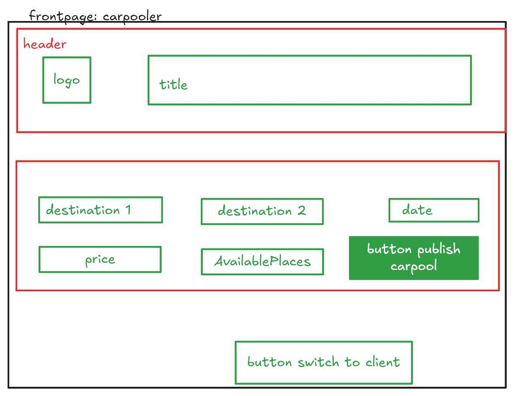

# Réduction de l'impact numérique d'un service numérique de covoiturage quotidien.

## Choix du sujet

Une portion non négligeable d'étudiants ont une voiture, et l'utilisent pour aller en cours. Les applications de covoiturage journaliers gagnent en popularité avec par exemple BlaBlaCar daily ou bien Karos (surtout dans le cadre de l'UTT où les trajets Karos sont remboursés par le département de l'Aube). Il nous semble utile de contribuer à cet essor des applications de covoiturage en proposant une application qui non seulement permet à ses utilisateurs de partager leurs trajets, mais est aussi soucieuse de l'impact environnemental de ses services numériques.

## Utilité sociale

En 2017, 74% des actifs en emploi qui déclarent se déplacer pour rejoindre leur lieu de travail utilisent leur voiture ([source : Insee](<https://www.insee.fr/fr/statistiques/5013868#:~:text=La%20voiture%20est%20le%20mode%20de%20transport%20privil%C3%A9gi%C3%A9%20pour%20aller,de%20personnes%20(figure%201).>)). De plus, sur plus d’un million de véhicules passés au crible de mai à juin 2022 sur 13 axes autoroutiers, **14,8 % seulement contenaient plus d’une personne, contre 17,4 % en 2021** ([source: roole.fr](https://media.roole.fr/transition/nouveaux-usages/autosolisme-85-des-francais-se-deplacent-seuls-en-voiture)) L'objectif est donc d'essayer de maximiser les trajets en voiture avec des passagers, en proposant aux conducteurs de prendre des passagers sur leur chemin en échange de rémunération. Augmenter le nombre de passagers moyens par voiture présente de multiples avantages sociaux et environnementaux, notamment :

- les coûts d'opération de la voiture (essence, maintenance, assurance) sont réduits pour le conducteur,
- les personnes sans voiture peuvent profiter de déplacements en voiture, qui peuvent être plus pratiques que les transports en communs ou les mobilités douces comme le vélo,
- le nombre total de voitures est réduit (deux personnes avec voiture peuvent choisir de covoiturer).

## Effets de la numérisation

De nos jours, la compétition dans le secteur des applications mobiles est rude et les fournisseurs d'application rivalisent de nouvelles fonctionnalités afin de gagner une place dans le téléphone des utilisateurs. Cette course aux fonctionnalités mène bien souvent à une grande augmentation des impacts environnementaux de l'activité de ces applications, on le voit par exemple avec la multiplication des fonctionnalités d'intelligence artificielle dans toutes les applications. D'après les chercheurs d'Open IA, la puissance de calcul requise pour l'entraînement des nouveaux modèles d'IA a doublé tout les 3.4 mois depuis 2012 ([source: earth.org](https://earth.org/the-green-dilemma-can-ai-fulfil-its-potential-without-harming-the-environment/)). Dans notre cas, nous cherchons donc à développer le minimum de fonctionnalités requises pour permettre au utilisateurs de Blutt de covoiturer correctement, tout en proposant une expérience utilisateur intuitive et agréable.

Les critères pour le développement sont les suivants :

- l'application ne doit pas chercher à remplacer des fonctionnalités déjà fournies par d'autre applications plus établies (exemple : pas de carte interactive, pas de fonctionnalité de messages intégrée...),
- l'application ne doit pas mener à une augmentation de l'usage de la voiture. Les trajets sur une distance aisément parcourue à pied doivent être découragés,
- l'impact général des systèmes numériques de l'application doit être le plus faible possible : pas d'intelligence artificielle pour faciliter les interactions ou d'algorithmes coûteux pour calculer les routes optimales. (On aurait par exemple pu en utiliser pour autoriser des requêtes de trajet en language naturel).

## Scénarios d'usage et impacts

Nous faisons l'hypothèse que les utilisateurs cherchant un trajet sur Blutt recherchent des trajets à effectuer régulièrement. Ils n'iront pas sur l'application tous les jours afin de créer un nouveau trajet. Une fois que le contact a été établi avec leur covoitureur, il feront les démarches en interne, sans passer par l'application. On établit deux scénarios possibles d'utilisation de l'application :

- je suis un conducteur et recherche des passagers, je publie mon trajet régulier sur Blutt,
- je suis passager et recherche un conducteur pour un trajet régulier, je recherche des trajets potentiels en spécifiant les horaires qui m'intéressent, ainsi que mes destinations de départ et d'arrivée.

### Scénario : trouver un covoiturage pour des trajet régulier

1. L'utilisateur entre sa destination de départ.
2. L'utilisateur entre sa destination d'arrivée.
3. L'utilisateur entre son horaire de départ souhaitée.
4. L'utilisateur lance la recherche de covoiturage en cliquant sur le bouton 'rechercher'.
5. L'utilisateur consulte la liste des covoiturages qui ont été trouvés, et en sélectionne un dans la liste.
6. L'utilisateur a accès à l'addresse mail du conducteur, et peut initier une démarche pour le contacter.

### Scénario : publier une offre de covoiturage pour des trajets réguliers

1. L'utilisateur clique sur le bouton 'Passer en mode conducteur'.
2. L'utilisateur entre sa destination de départ.
3. L'utilisateur entre sa destination d'arrivée.
4. L'utilisateur entre son horaire de départ souhaitée.
5. L'utilisateur sélectionne le nombre de places disponibles pour des passagers dans sa voiture.
6. L'utilisateur publie son trajet en cliquant sur le bouton 'publier mon trajet'.

## Impact de l'exécution des scénarios auprès de différents services concurrents

L'EcoIndex d'une page (de A à G) est calculé (sources : [EcoIndex](https://www.ecoindex.fr/comment-ca-marche/), [Octo](https://blog.octo.com/sous-le-capot-de-la-mesure-ecoindex), [GreenIT](https://github.com/cnumr/GreenIT-Analysis/blob/acc0334c712ba68939466c42af1514b5f448e19f/script/ecoIndex.js#L19-L44)) en fonction du positionnement de cette page parmi les pages mondiales concernant :

- le nombre de requêtes lancées,
- le poids des téléchargements,
- le nombre d'éléments du document.

Nous avons choisi de comparer l'impact des scénarios sur les services de deux solutions de covoiturage en ligne :

- [La roue verte](https://www.laroueverte.com)
- [Mobicoop](https://www.mobicoop.fr)

Ce sont deux solutions offrant des fonctionnalités similaires et qui ont la particularité de se vouloir des solutions simples et limitées en fonctionnalités contrairement à d'autres solutions plus populaires commme [BlaBlaCar](https://www.blablacar.fr) ou [Karos](https://www.karos.fr).

Ainsi, voici les résultats obtenus:
- [Résultats pour les deux scénarios](https://htmlpreview.github.io/?https://raw.githubusercontent.com/UTT-GL03/Blutt/refs/heads/main/benchmark/result.html)

## Maquette de l'interface et échantillon de données

Ainsi, en considérant les scénarios pris en compte dans l'étape précédante, nous avons décidé de créer des maquettes pour modéliser les pages de notre site et nous avons génerer un échantillon de données .
Concernant les maquettes, nous avons modélisé 4 pages:
1. La page d'accueil vue par un client
   
2. La page d'accueil vue par un conducteur
   
3. La page de recherches vue par le client
   
4. La page de confirmation vue par le conducteur
   

## Prototype n°1 : Fonctionnalités pour le scénario prioritaire avec données chargées de manière statique

Concernant cette première version de notre prototype, on charge nos données directement dans notre site.
On ajoute aussi seulement la fonctionnalité principale qui est de trouver un covoiturage en rentrant le lieu de départ, la destination ainsi que la date.
Pour celà nous avons nous allon avoir besoin de naviguer entre deux pages, la page d'accueil et la page de recherches, toutes deux vues par le client.

### Page d'accueil

Nous avons developpé un prototype de la page d'accueil (cf. Fig. 2)  pour qu'elle permette aux clients de faire une recherche. 

__Fig.5__: Prototype de la page d'accueil.

Pour l'instant, nous avons essayé de faire une page d'accueil simple et minimaliste avec des élements de CSS basiques. Le but étant de passer à un framework plus puissant à la suite tout en essayant de garder un bon impact environnemental.

Ainsi, contrairement à nos sites concurrents, nous avons opté pour une page sobre sans images, meme si elles peuvent attirer l'attention des covoitureurs mais elles ne sont pas obligatoires pour ce type de fonctionnalités. Nous avons décidé d'avoir une entete avec le nom et le logo de Blutt avec un conteneur contenant un formulaire pour les lieux de départ, d'arrivée ainsi que la date.

|                       | EcoIndex | GES (gCO2e) | Taille du DOM | Requêtes | Taille de la page (ko) |
|-----------------------|----------|-------------|---------------|----------|------------------------|
| Mode "développement"  |          |             |               |          |                        |
| Mode "pré-production" |          |             |               |          |                        |

__Tab.1__: Évaluation de l'impact du prototype de la page d'accueil.

A remplir

### Page de recherche

Concernant la page de recherche, nous avons ajouté quelques conteneurs contenant des informations sur plusieurs trajets.
De meme que pour la page d'accueil, nous avons opté pour une implémentation sobre, avec le minimum de fonctionnalités possibles.
Ainsi, chaque choix comporte le nom, prénom du covoitureur

